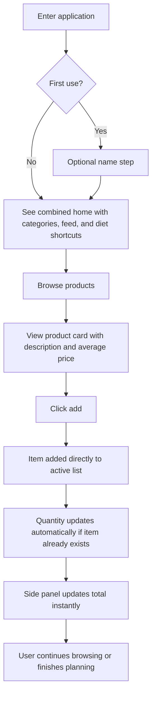
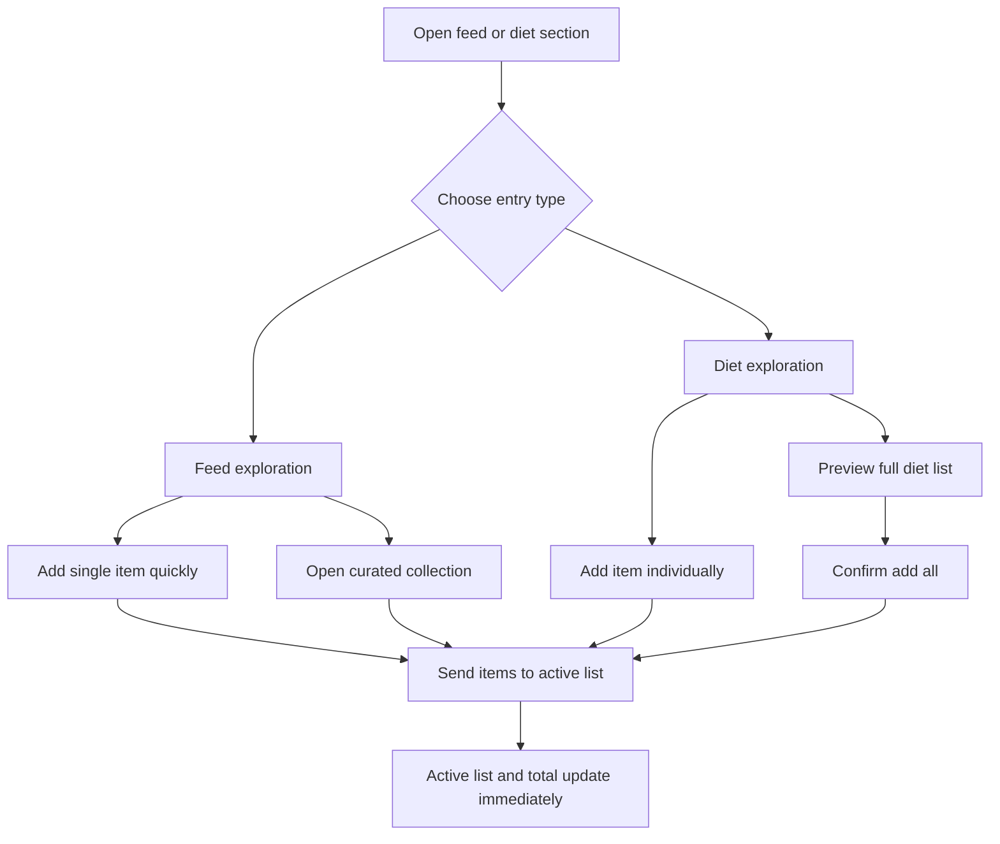
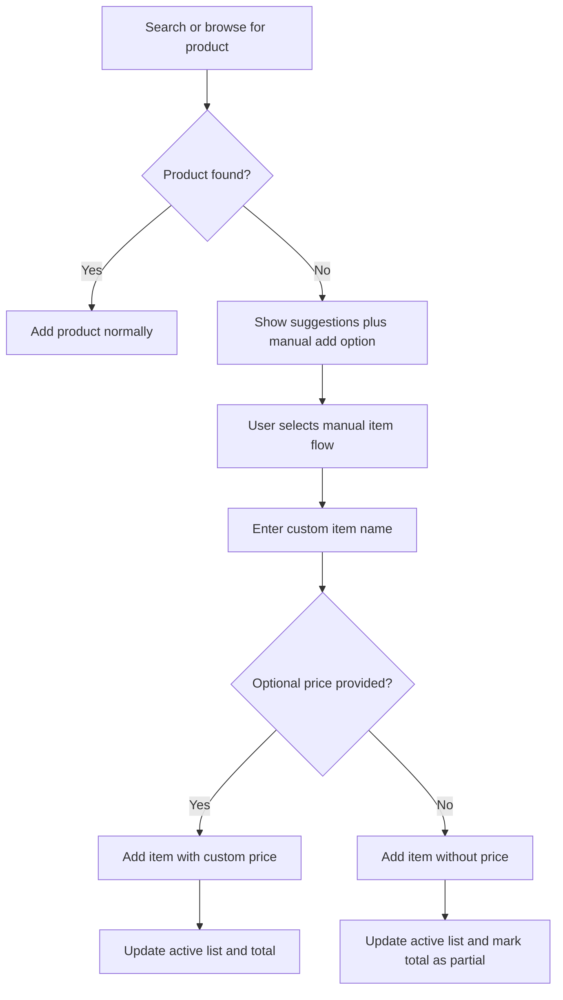

---
stepsCompleted:
  - 1
  - 2
  - 3
  - 4
  - 5
  - 6
  - 7
  - 8
  - 9
  - 10
  - 11
  - 12
  - 13
  - 14
lastStep: 14
inputDocuments:
  - C:\Users\Kauan\Downloads\Projetos\Projeto Lista de mercado\_bmad-output\brief.md
  - C:\Users\Kauan\Downloads\Projetos\Projeto Lista de mercado\_bmad-output\planning-artifacts\prd.md
  - C:\Users\Kauan\Downloads\Projetos\Projeto Lista de mercado\_bmad-output\planning-artifacts\prd-validation-report.md
---

# UX Design Specification Projeto Lista de mercado

**Author:** Kauan
**Date:** 2026-03-09

---

<!-- UX design content will be appended sequentially through collaborative workflow steps -->

## Executive Summary

### Project Vision

Projeto Lista de mercado is a web-based grocery planning experience designed to help users prepare purchases before leaving home with more clarity, less mental effort, and better spending awareness. The product should go beyond a traditional checklist by combining list building, estimated pricing, product discovery, and diet-guided suggestions in a single cohesive experience.

From a UX perspective, the product vision is to make grocery planning feel guided and confident rather than manual and fragmented. Users should feel that the interface helps them remember what to buy, understand how much they are likely to spend, and discover relevant items without needing to build everything from scratch.

### Target Users

The primary user is a casual and practical grocery shopper who wants to organize purchases quickly and avoid forgetting important items. This user is not looking for a complex planning system. They want a fast, intuitive web experience that helps them prepare at home before going to the market.

A secondary user is someone with diet-oriented shopping goals who wants clearer guidance about what to buy. Even in this case, the experience should remain accessible and practical rather than technical or overly specialized.

Across both user types, the UX should support low-friction planning, immediate comprehension, and responsive use across desktop and mobile browsers.

### Key Design Challenges

One core challenge is balancing three equally important product areas: shopping list, discovery feed, and diet guidance. The experience cannot make any of them feel disconnected or secondary, or users may fail to understand the product's full value.

Another challenge is presenting cost awareness in a strong and useful way without making the interface feel like a budgeting tool or spreadsheet. Price visibility must feel supportive and confidence-building, especially for casual users.

A third challenge is reducing cognitive load for users who want practical help rather than a feature-heavy system. The UX must help them act quickly, understand what matters immediately, and complete planning with minimal friction.

### Design Opportunities

The biggest design opportunity is to turn grocery planning into a guided experience that reduces memory burden and increases confidence before shopping. This can create a stronger emotional payoff than a standard list app.

A second opportunity is to make estimated total cost a central UX anchor that gives users a sense of control throughout the planning flow. If done well, this can become one of the product's strongest trust-building elements.

A third opportunity is to position feed and diet features as smart accelerators for list creation. Instead of acting as separate destinations, they can help users complete their shopping plan faster and with less guesswork.

## Core User Experience

### Defining Experience

The core experience of Projeto Lista de mercado is helping users build a shopping list quickly by browsing organized product categories, discovering products through feeds, and exploring diet-based suggestions. The experience must feel more structured and useful than a common grocery list because users are not starting from a blank state. They are guided toward what to buy.

The most frequent user action is adding items to the shopping list. This means the product's UX success depends heavily on how fast, clear, and reliable the add-to-list flow feels. Product categories, feed entries, and diet suggestions should all support this same core action rather than feel like separate product areas.

A defining success factor is price visibility. Users should be able to see the prices of products they want to buy and build an immediate sense of total expected spend before leaving home. The product should make this feel natural and continuously visible throughout the planning flow.

### Platform Strategy

Projeto Lista de mercado is a responsive web application with desktop as the primary usage context for the first UX direction. The main interaction model should therefore prioritize mouse and keyboard efficiency while still maintaining responsive adaptability for smaller screens.

Because users are expected to plan purchases before leaving home, the desktop experience should emphasize overview, scanning efficiency, and easy multi-section navigation across categories, feed, diet, and active list. Offline support is not a priority in this phase and does not need to shape the core UX strategy.

### Effortless Interactions

Adding an item to the shopping list should feel instant and obvious regardless of whether the user comes from categories, feed, or diet content. The user should never have to wonder what happens next or where the item went.

Product prices should be visible near the moment of decision so users can judge value and expected spend without extra steps. The running cost perception should update naturally as the list evolves.

Navigation between core sections should feel lightweight and coherent. Categories, feeds, and diets should not behave like disconnected modules. Instead, they should act as different entry points into the same list-building experience.

The system should also reduce friction by handling updates automatically wherever possible, especially around price awareness, item addition, and list state continuity during planning.

### Critical Success Moments

One critical success moment happens when the user browses a category, quickly adds several products, and immediately sees a clearer sense of what they are going to spend. This is the point where the product becomes more valuable than a traditional list.

Another success moment happens when feed and diet content help the user remember or discover products they would otherwise forget. This reinforces the product's role as a planning assistant rather than a passive checklist.

The most fragile moments in the experience are the core functional interactions. If adding items fails, if prices are unclear, or if navigation feels unstable, users will lose trust quickly. Reliability in the core flow is therefore essential to perceived quality.

### Experience Principles

The shopping list is the center of action, but categories, feed, and diet experiences must all accelerate list creation.

Price visibility must stay close to decision-making so users can understand expected spending naturally while building the list.

The interface must reduce mental effort by replacing blank-list behavior with guided product discovery.

The desktop experience should feel direct, stable, and efficient, with reliable interactions across all core flows.

## Desired Emotional Response

### Primary Emotional Goals

Projeto Lista de mercado should make users feel in control, calm, confident, practical, and satisfied. The product should reduce the uncertainty that usually comes with grocery planning and replace it with a stronger sense of readiness before leaving home.

Its key emotional differentiator is not excitement for its own sake, but the reassuring feeling that the user can see product prices, build a list with confidence, and understand expected spending as they plan. This should make the experience feel more useful and dependable than a common grocery list.

After completing their main task, users should feel prepared, relieved, secure about their expected spending, and satisfied with the planning process.

### Emotional Journey Mapping

When users first encounter the product, it should feel clear, approachable, and immediately useful. The interface should communicate that planning groceries here will be easier and more organized than using a generic list.

During the core experience, the dominant emotional tone should be speed and control. Discovery should still exist through categories, feed, and diet content, but it should support the stronger feeling that the user is confidently building a complete and cost-aware shopping plan.

If something goes wrong, the experience should preserve calm, clarity, and trust. The product should never feel unstable, confusing, or fragile during important actions.

When users return, the product should feel familiar and supportive. Features such as suggestions based on recently added items should reinforce continuity, convenience, and confidence.

### Micro-Emotions

Confidence is more important than surprise for this product. Users need to believe the interface is dependable and that price visibility supports real planning decisions.

Control is more important than playfulness. The product should still feel light to use, but its emotional strength comes from helping users feel organized and capable.

Satisfaction matters more than delight as a primary emotional target. Small moments of pleasure are useful, but the deeper goal is a reliable feeling of having planned well.

Clarity should remain central, while moments of discovery through feed and diet suggestions should enrich the experience without making it feel noisy or overloaded.

### Design Implications

To support confidence and control, prices and total-cost feedback should remain visible and easy to interpret throughout the planning flow. Users should never feel uncertain about where they stand financially while building their list.

To support calm and practicality, the interface should avoid visual clutter, unnecessary density, and interactions that feel heavy or complicated. The product should guide users without overwhelming them.

To support trust, core actions such as adding items, updating totals, and navigating between sections must feel stable and predictable. Suggestion systems should feel helpful and familiar rather than intrusive.

### Emotional Design Principles

Design for calm control rather than high stimulation.

Make financial awareness feel reassuring, not stressful.

Use clarity as the foundation, with discovery layered in carefully.

Preserve a lightweight feeling by avoiding confusion, instability, and a heavy interface.

## UX Pattern Analysis & Inspiration

### Inspiring Products Analysis

The project draws functional inspiration from Lista Puro as a reference for the grocery-list behavior, but the intended UX direction goes far beyond a simple checklist interface. The goal is to preserve the usefulness of list-based planning while elevating the overall experience into something more modern, polished, and premium.

Apple is a major inspiration for the visual and emotional direction. Its influence is relevant in the use of dark surfaces, restrained sophistication, strong hierarchy, and premium product presentation. For Projeto Lista de mercado, this suggests an interface that feels elegant, professional, and highly intentional rather than casual or purely utilitarian.

Additional inspiration can be taken from Linear and Notion. Linear provides a strong example of how a dark interface can still feel sharp, fast, and professional without becoming visually noisy. Notion provides a useful model for information organization, calm scanning, and clarity without making the interface feel cluttered or intimidating.

Across these references, one strong idea stands out: products should feel presented, not merely listed. This supports the requirement that each grocery item should include at least a short description and average price so the catalog feels more useful and more premium than a plain shopping list.

### Transferable UX Patterns

A strong card-based presentation pattern is transferable to this project. Each product should be shown with a clear name, a short supporting description, and visible average pricing, making selection feel informed and guided.

High-contrast hierarchy and disciplined spacing are also important transferable patterns. A dark interface should still feel breathable, scannable, and structured, especially because the product must support category browsing, feed exploration, diet suggestions, and active list management in the same environment.

Another transferable pattern is the idea of making professional simplicity feel intentional. Instead of overloading the user with visual effects or too much information, the interface should use refined typography, clean grouping, and clear calls to action to create confidence and control.

### Anti-Patterns to Avoid

The product should avoid dark UI patterns that rely on excessive glow, overly aggressive contrast, or decorative visuals that make the interface feel flashy instead of sophisticated.

It should also avoid cluttered product presentation. If items are shown only as plain text labels without enough supporting context, the product will lose much of its premium and guided-planning value.

Another anti-pattern is fragmented navigation. Feed, diet, categories, and list should not feel like unrelated areas or separate mini-products. They must feel like connected paths toward the same outcome: building a better shopping list.

Finally, the experience should avoid feeling heavy. Too many elements, too much density, or unclear prioritization would directly conflict with the desired emotional goals of calm, confidence, and control.

### Design Inspiration Strategy

The design strategy should adopt the premium visual discipline of Apple, especially in hierarchy, restraint, polish, and product presentation. It should adapt the practical list-building clarity of Lista Puro while significantly improving the sophistication of the interface.

It should also borrow from Linear the sense of precision, professional dark styling, and fast clarity, while using Notion-like information organization to keep the interface understandable and lightweight.

The result should be a modern all-black product that feels professional, elegant, and highly usable. It must not look like a generic grocery app. It should feel like a premium planning tool where users can browse products, understand pricing, and build a smarter shopping list with confidence.

## Design System Foundation

### 1.1 Design System Choice

Projeto Lista de mercado should use a themeable design system foundation built on shadcn/ui with Tailwind CSS. This approach provides a strong component base while preserving enough flexibility to create a distinctive all-black premium interface rather than a generic application look.

This is the best-fit approach because the product needs both speed of implementation and a highly customized visual identity. A fully custom design system would create unnecessary overhead for the current project stage, while a rigid established system would make it harder to achieve the desired sophisticated and modern presentation.

### Rationale for Selection

The selected foundation aligns with the existing project direction and supports the product's UX goals. shadcn/ui offers accessible, composable primitives that can be heavily styled and adapted without forcing a fixed visual language.

This is especially important because Projeto Lista de mercado needs to feel professional, modern, and elegant while still supporting practical grocery-planning flows. The design system must allow price visibility, product presentation, dark surfaces, and strong hierarchy to work together without making the interface feel heavy.

The choice also reduces implementation risk. It gives the project a reliable component foundation for forms, cards, tabs, dialogs, and interactive controls while still making room for signature product components that express the brand more clearly.

### Implementation Approach

The implementation should use shadcn/ui as the structural UI layer for core interface elements such as buttons, inputs, tabs, cards, dialogs, sheets, and form controls. Tailwind CSS should be used to define the visual system and enforce consistency across spacing, sizing, surface treatment, and responsive behavior.

On top of this base, the product should define custom application-level components for its most important experiences, including product cards, feed cards, diet collection cards, category navigation, and price summary panels. These should not feel like raw library components, but like product-specific interfaces built from a controlled system foundation.

### Customization Strategy

The customization strategy should focus on creating a premium all-black interface with disciplined spacing, refined typography, and strong visual hierarchy. The default look of the underlying component library should be treated only as a starting point, not as the finished product identity.

Custom design tokens should be defined for dark surfaces, elevated surfaces, text contrast, subtle borders, highlighted price elements, and interaction states. Product cards should consistently include product name, a short supporting description, and average price. The visual system should emphasize clarity, confidence, and sophistication while avoiding clutter, visual noise, or generic dashboard aesthetics.

## 2. Core User Experience

### 2.1 Defining Experience

The defining experience of Projeto Lista de mercado is giving users an immediately useful grocery-planning environment where categories, product feeds, and ready-made diet suggestions are already available as actionable starting points. Instead of beginning with a blank list, users enter a guided system that helps them decide what to buy faster.

What makes the experience memorable is that users can browse products, discover diet-oriented suggestions, and add items directly to the same active shopping list with minimal friction. The experience should feel like a smart planning assistant rather than a simple grocery checklist.

A core value moment happens when the user sees that the system already offers helpful product paths through categories, feeds, and diets, and that every decision they make contributes instantly to a visible shopping total.

### 2.2 User Mental Model

Users are likely to arrive with habits built from paper lists, note apps, simple checklist tools, and memory-based shopping preparation. Because of this, they will initially expect something list-oriented, but they will quickly understand more value if the interface presents itself as a structured and intelligent planning tool.

The ideal mental model is a combination of smart list, product catalog, shopping planner, and purchase assistant. Users should feel that the system already knows how to help them start and does not require them to figure out the workflow from scratch.

Confusion is most likely to happen if categories, feeds, diets, and the active list feel disconnected. The interface must therefore make it obvious that all these areas serve the same goal: building a better shopping plan.

### 2.3 Success Criteria

The defining experience succeeds when users instantly understand where to explore and where to add products. The interface should communicate the action model without explanation.

Users should be able to add products directly to the list without an unnecessary intermediate step. Product cards should provide enough context through short descriptions and average pricing so users can make decisions quickly.

The experience should also make progress visible. The active total should update immediately, remain visible in the side panel, and reinforce the feeling that the user is building a complete and cost-aware shopping plan.

### 2.4 Novel UX Patterns

This experience should primarily rely on established interaction patterns that users already understand, including product cards, category browsing, direct add actions, and a persistent summary panel.

The innovation comes from combining these familiar patterns into a single guided shopping-planning flow. Rather than inventing a new interaction model, Projeto Lista de mercado should feel special because it unifies browsing, recommendation, diet guidance, and budget awareness in one coherent experience.

This means the UX should avoid novelty for its own sake and instead focus on making familiar patterns feel more useful, more premium, and more connected.

### 2.5 Experience Mechanics

The experience begins with immediate visibility of categories and products so users can start exploring without setup friction. Categories, feed content, and diet suggestions should all be available as first-class entry points into the shopping flow.

When the user clicks to add a product, it should be added directly to the active list. Product cards should already display a short description and average price so that decision-making happens at the point of browsing rather than behind extra detail views.

The active list and estimated total should remain visible in a persistent side panel during desktop use. This creates continuous awareness of progress and expected spending.

Feed items and diet items should add into the same active shopping list rather than creating parallel flows. The system should provide immediate feedback whenever an item is added and whenever the total changes, reinforcing clarity, momentum, and trust.

## Visual Design Foundation

### Color System

Projeto Lista de mercado should use a premium all-black visual foundation built from layered dark surfaces rather than a single flat black background. The interface should feel refined, controlled, and elegant, with subtle separation between background, elevated cards, panels, and interactive zones.

A sophisticated green should be used as the primary accent for product-related emphasis and selective interactive highlights. This accent should communicate freshness and guidance without becoming loud or overly saturated. It should be applied carefully to preserve the calm and premium tone of the product.

Pricing elements should appear in neutral and elegant tones rather than highly promotional colors. This supports trust and sophistication while avoiding the visual language of discount commerce or cluttered supermarket advertising. Semantic colors for success, warning, and error should remain available, but the overall system should stay restrained and minimal.

### Typography System

The typography should follow a modern, clean, premium direction inspired by Apple's visual language. It should feel refined and highly legible, with strong hierarchy and disciplined restraint rather than decorative personality.

Headings should feel spacious, crisp, and intentional, supporting a premium product identity. Body text should remain simple and highly readable, especially because users need to scan product cards, categories, prices, and summaries quickly.

The type system should prioritize clarity in functional UI while still giving the product an elevated tone. This means balancing editorial elegance with practical readability across cards, side panels, tabs, and shopping-list content.

### Spacing & Layout Foundation

The interface should use a more spacious and premium layout strategy rather than a dense utility-first arrangement. Content groupings should have enough breathing room to make the product feel calm, organized, and high-quality.

Desktop layout should emphasize a stable multi-zone structure, with browsing content as the main focus area and the active shopping summary positioned in a fixed but discreet side panel. This panel should remain visible to preserve spending awareness while staying visually secondary to product discovery.

Spacing should reinforce hierarchy and reduce cognitive load. Cards, sections, and navigation elements should be separated clearly enough to support fast scanning, but without making the interface feel empty or disconnected. An 8px spacing system is an appropriate base for consistency, with larger multiples used to create premium rhythm across sections.

### Accessibility Considerations

Accessibility should be treated as a core part of the visual system, especially because the product uses a dark interface. Text contrast must remain high across all major surfaces so that users can scan products, prices, descriptions, and totals without strain.

The green accent should be selected and applied in a way that preserves readability and does not become the sole carrier of meaning. Interactive states such as hover, focus, selection, and active list updates should remain visually clear and distinguishable.

Typography sizing, spacing, and surface contrast should support long-term usability in desktop planning sessions. The product should feel elegant, but never at the cost of legibility, clarity, or confidence.

### Motion & Interaction Animation

Motion should be treated as part of the premium product identity, not as decoration. Every animation in Projeto Lista de mercado should reinforce clarity, control, and perceived quality while remaining lightweight and technically efficient.

The motion language should feel restrained, smooth, and confident, closer to Apple's interaction style than to playful consumer-app animation. Transitions should be subtle, polished, and fast enough to preserve planning momentum. The product should never feel bouncy, exaggerated, noisy, or overloaded with competing movement.

The most important motion moments are tied directly to user confidence:

- when a product is added to the active list
- when a diet card or curated collection is added
- when the total estimated price updates
- when suggestion blocks and feed sections appear
- when overlays, sheets, or preview panels open and close

**Product Add Animation**

When a user adds a product card to the list, the card should provide immediate visual confirmation through a refined state transition. The recommended behavior is:

- button state transitions instantly from default to confirmed
- card receives a short highlight pulse or surface accent confirmation
- a subtle directional motion suggests the item has been sent to the active list
- the matching line item appears in the active list with a soft fade-and-slide entrance

This animation should feel precise and reassuring, not theatrical. It must communicate success without interrupting browsing.

**Diet Card Add Animation**

When a user adds a specific diet card or a diet-based product set, the interaction should feel more substantial and premium than a normal single-item add. The recommended motion pattern is:

- the diet card slightly elevates and tightens visually on click
- a controlled confirmation sweep or surface glow moves across the card
- selected/add-confirmed state locks in cleanly
- related additions in the side list appear in staggered but very subtle sequence

This should create the impression that the system has executed a meaningful planning action successfully. It should feel professional, intelligent, and premium.

**Total Update Animation**

The estimated total should always update with a restrained transition rather than a sudden hard swap. Recommended behavior:

- numerical value transitions smoothly
- optional light emphasis pulse on the total container
- no aggressive scaling, flashing, or color jump

This makes financial feedback feel stable and trustworthy.

**Card Hover and Focus Motion**

Product cards, feed cards, and diet cards should use very light hover and focus motion on desktop:

- slight upward translation or elevation
- subtle shadow refinement
- controlled border or surface accent change

These states should help users feel precision and tactility without turning the interface into a motion-heavy experience.

**Entrance and Section Reveal Motion**

Feed modules, suggestion strips, and diet collections may use light staged reveal on first render:

- soft fade-in
- very small upward translate
- short stagger between sibling cards

This can increase perceived polish, but it must remain understated and should never delay usability or block immediate interaction.

**Overlay and Panel Motion**

Sheets, dialogs, previews, and mobile list panels should open with calm directional motion and strong focus continuity:

- side panel slides in with fade
- modal rises or scales minimally with backdrop fade
- closing motion should be slightly faster than opening

Motion here must support orientation and context, not spectacle.

**Motion Performance Rules**

Animation performance is a product requirement. Motion should be implemented using lightweight transforms and opacity wherever possible, avoiding expensive layout-triggering properties. The experience must remain smooth on common desktop hardware and modern mobile browsers.

The system should avoid:

- long chained animations
- large blur animations in motion
- excessive box-shadow animation
- simultaneous animation of many heavy elements
- decorative animations unrelated to task progress

Reduced-motion preferences should be respected. When users prefer reduced motion, all non-essential animation should simplify to quick fades or direct state changes while preserving clarity of feedback.

**Suggested Motion Timing**

- micro feedback: 120ms to 180ms
- card state transitions: 180ms to 240ms
- panel and overlay transitions: 220ms to 320ms
- staggered group reveal: 30ms to 60ms between items

Easing should feel smooth and premium, favoring ease-out or custom curves that decelerate gently into rest.

### Motion Implementation Specification

The motion system should be implemented as a reusable interaction layer rather than one-off animation decisions scattered across components. Each important motion event should have a named behavior and a consistent trigger rule so that the product feels coherent and technically maintainable.

**Motion Tokens**

The implementation should define a small motion token set shared across the application:

- `motion-fast`: 140ms
- `motion-base`: 200ms
- `motion-medium`: 260ms
- `motion-panel`: 300ms
- `motion-stagger`: 40ms

Recommended easing tokens:

- `ease-premium-out`: primary deceleration curve for confirmations and reveals
- `ease-premium-standard`: balanced curve for component state changes
- `ease-premium-in-out`: used for overlays and panel transitions

**Named Animation Behaviors**

`card-add-confirm`
- Trigger: user adds an individual product card
- Effect: button confirms immediately, card gets a restrained highlight/accent confirmation, optional slight directional translation toward the list
- Duration: `motion-base`

`list-item-enter`
- Trigger: item appears in active list after add action
- Effect: short fade plus small vertical or horizontal entrance movement
- Duration: `motion-fast`

`diet-card-apply`
- Trigger: user adds or confirms a specific diet card / diet set
- Effect: card elevates slightly, receives premium sweep/highlight confirmation, then settles into selected or completed state
- Duration: `motion-medium`

`diet-items-stagger-enter`
- Trigger: multiple diet items added into the active list
- Effect: list rows appear in subtle stagger sequence
- Duration: `motion-fast` each, `motion-stagger` between items

`price-total-update`
- Trigger: estimated total changes
- Effect: numeric transition and restrained emphasis pulse on total container
- Duration: `motion-fast`

`card-hover-lift`
- Trigger: desktop hover/focus on cards
- Effect: tiny translateY, surface refinement, border/shadow adjustment
- Duration: `motion-fast`

`panel-open` / `panel-close`
- Trigger: mobile list sheet, dialogs, preview drawers
- Effect: directional slide with opacity transition
- Duration: `motion-panel`

`section-reveal`
- Trigger: first render of feed groups, suggestion strips, diet groups
- Effect: fade and tiny upward translate with optional stagger
- Duration: `motion-medium`

**Component-Level Motion Mapping**

`ProductCard`
- hover: `card-hover-lift`
- add action: `card-add-confirm`
- if already added: use confirmation state plus quantity increment feedback rather than replaying a large animation

`DietCollectionCard`
- hover: `card-hover-lift`
- preview open: `panel-open` or modal transition
- confirm add: `diet-card-apply`

`ActiveListPanel`
- new row: `list-item-enter`
- quantity increment: restrained inline emphasis, not full re-entry animation
- total change: `price-total-update`

`FeedCollectionBlock`
- first render: `section-reveal`
- individual add from feed: `card-add-confirm`

`SuggestionStrip`
- initial appearance: `section-reveal`
- repeat/re-add actions: same product add confirmation language as normal catalog items

`ManualItemComposer`
- validation: immediate inline state transition only
- submit success: route through `list-item-enter` and `price-total-update`

**Engineering Constraints**

Developers should prefer:

- `transform`
- `opacity`
- restrained `filter` use only when static or extremely limited

Developers should avoid animating:

- width and height where not strictly necessary
- top/left positional layout properties
- heavy box-shadow changes across many elements
- large blur values during active transitions

Where animated number transitions are used, they must remain stable and legible. If implementation complexity is high, priority should be given to smooth container emphasis over overly complex numeric tweening.

**Reduced Motion Behavior**

When `prefers-reduced-motion` is enabled:

- remove staggered entrances
- convert directional movement into short opacity/state changes
- keep total update feedback minimal
- preserve confirmation clarity without decorative movement

**Implementation Priority**

Phase 1 motion:
- `card-add-confirm`
- `list-item-enter`
- `price-total-update`
- `panel-open`

Phase 2 motion:
- `diet-card-apply`
- `diet-items-stagger-enter`
- `section-reveal`

Phase 3 motion:
- advanced numeric polish
- premium refinement of hover states
- contextual choreography between suggestion blocks and list updates

## Design Direction Decision

### Design Directions Explored

Multiple design directions were explored through a dedicated HTML showcase, all based on the established all-black premium foundation, sophisticated green accent, discreet side summary panel, and product-card-driven planning flow.

The explorations varied mainly in layout weight, information hierarchy, degree of editorial presentation, and the role of suggestion-driven planning. Some directions leaned more toward premium visual storytelling, while others emphasized precision, utility, or recommendation-driven assistance.

The exploration confirmed that the most suitable direction for Projeto Lista de mercado is not a purely technical interface and not a purely decorative retail showcase. The product needs a balanced visual language that feels premium and elegant while still surfacing smart planning assistance clearly.

### Chosen Direction

The chosen direction is a combination of Direction 1 and Direction 6 from the visual exploration set.

Direction 1 provides the primary visual base: a premium editorial layout with strong hierarchy, spacious composition, elegant product cards, and a restrained Apple-like sense of refinement. This direction best supports the desired all-black premium tone and keeps the experience breathable rather than heavy.

Direction 6 contributes the product-intelligence layer: recent-item suggestions, diet shortcuts, recommendation blocks, and a stronger sense that the interface is actively helping users plan rather than simply displaying products. This makes the product feel more like a shopping assistant than a static catalog.

### Design Rationale

This combination best supports the product's core UX goals. It preserves calm, confidence, and visual sophistication while also making feed, diet, and recommerce-style suggestions feel central to the experience rather than secondary.

Using Direction 1 as the visual foundation reduces the risk of the product feeling crowded or dashboard-like. Bringing in Direction 6 as a secondary layer ensures that the interface communicates intelligence, convenience, and continuity across sessions.

The result is a premium planning product where discovery, guided suggestions, and list-building all feel like part of the same polished experience. This aligns strongly with the emotional goals of control, trust, and satisfaction.

### Implementation Approach

The implementation should treat the Direction 1 layout and visual weight as the default shell for key screens, especially the desktop home and planning experience. Spacious cards, a refined browsing surface, and a discreet fixed side panel should define the overall structure.

Direction 6 elements should then be layered into this shell through dedicated sections such as "based on your last list", "ready-made diet picks", and "smart suggestions". These blocks should appear as curated assistant modules inside the premium editorial interface rather than as competing dashboard widgets.

This approach keeps the product visually consistent while allowing the intelligence layer to enrich the core journey without overwhelming it.

## User Journey Flows

### Journey 1: Build the Main Shopping List

This journey represents the primary planning flow. The user enters the application and may pass through a lightweight first-use step that asks only for their name. Immediately after that, they encounter a combined home experience with categories, suggestions, and diet shortcuts available from the start. This reduces blank-state friction and helps the user begin planning without needing to create an account or decide where to start first.

The user browses products, sees short descriptions and average prices directly on cards, and adds items immediately to the active list. The interface provides direct visual feedback when an item is added, while the persistent side panel updates the estimated total in real time. If the user adds the same item again, the system should increase quantity automatically rather than creating unnecessary duplication.

### Journey 2: Discover Through Feed and Diet

This journey captures the product's differentiating guidance layer. The user can enter through the feed for discovery or through a diet section for more intentional planning, but both paths should lead into the same active shopping list.

In feed experiences, users should be able to add individual items quickly while still having the option to explore collections or curated groups. In diet experiences, the product should support both item-by-item selection and bulk-add behavior. For full diet additions, a preview before confirmation is the best balance between speed and control.

### Journey 3: Add a Manual Item Outside the Catalog

This journey protects continuity when the catalog is incomplete. If the user cannot find a product, the system should never block planning. Instead, it should offer automatic suggestions plus a clear manual-add option.

When a manual item is added, it should still enter the active list even if no price is known. The preferred behavior is to allow an optional price entry, while keeping the item valid even without price data. The system should communicate clearly that the total may remain partial when some items do not yet have pricing.

### Journey Patterns

Across these journeys, the product should standardize several patterns. All primary entry points should lead into the same active list rather than creating separate planning modes. Direct add behavior should be the default interaction style, with preview and confirmation used only when the action is larger in scope, such as importing a full diet list.

Feedback should always be immediate and local to the user's action. Product cards, list updates, and the side-panel total should work together as one continuous feedback system. The UI should also standardize continuity patterns such as recent-item suggestions, quantity auto-increment, and graceful fallback to manual entry.

If the optional name step is used, it should feel like a welcome and personalization layer rather than a registration flow. It must ask only for the user's name, allow immediate continuation, and store that information locally for greeting and contextual microcopy.

### Flow Optimization Principles

The first principle is to minimize steps between discovery and list creation. If users already know what they want, they should be able to add it instantly.

The second principle is to preserve clarity and control during larger actions. Bulk additions should be fast, but they should still respect user confidence through previews or confirmations where appropriate.

The third principle is to avoid dead ends. Missing products, repeated products, and partial price coverage should all be handled gracefully so that the planning flow never collapses.

The fourth principle is to keep financial awareness continuous. The estimated total should remain visible and responsive throughout the journey so users always feel informed while building the list.

## Component Strategy

### Design System Components

The component strategy should use shadcn/ui as the foundation layer for standard interface primitives and interaction patterns. Core components such as Button, Input, Tabs, Card, Dialog, Sheet, Badge, Checkbox, Separator, Tooltip, ScrollArea, and Skeleton are sufficient to cover the product's structural UI needs.

This foundation provides speed, accessibility, and consistency while avoiding unnecessary reinvention. However, the product's differentiating value does not live in raw foundation components. It lives in how these primitives are composed into premium, product-specific planning experiences.

The gap is therefore not in basic controls, but in the specialized interfaces needed for grocery planning, pricing awareness, recommendation flows, and the persistent shopping summary.

### Custom Components

**ProductCard**
Purpose: Present a product in a premium, decision-ready format with name, short description, average price, and direct add action.
Usage: Used across categories, feed, and recommendations.
States: Default, hover, active, added, unavailable price, disabled.
Accessibility: Entire card content must be screen-reader friendly, with a clearly labeled primary add action and visible keyboard focus states.

**ActiveListPanel**
Purpose: Maintain constant awareness of the active shopping list and estimated spend.
Usage: Fixed side panel on desktop and adapted summary panel on smaller screens.
States: Empty, populated, partial-total state, loading, updated.
Accessibility: Must support keyboard navigation through items, clear item labels, and accessible total summaries.

**CategoryRail**
Purpose: Provide structured navigation across major grocery categories without fragmenting the main experience.
Usage: Persistent or semi-persistent navigation area in the browsing surface.
States: Default, active, hover, overflow.
Accessibility: Clear active-state indication, semantic navigation structure, and keyboard traversal support.

**FeedCollectionBlock**
Purpose: Surface curated suggestions, recent items, and discovery content in a way that feels integrated rather than promotional.
Usage: Home and feed experiences.
States: Default, loading, populated, empty.
Accessibility: Collection headings and actions should be clearly labeled and screen-reader compatible.

**DietCollectionCard**
Purpose: Present ready-made diet paths with a short explanation and actions for previewing or adding items.
Usage: Diet entry points and curated guidance blocks.
States: Default, hover, expanded, preview, added.
Accessibility: Must expose diet labels, descriptions, and bulk-add actions clearly for assistive technologies.

**QuickAddFeedback**
Purpose: Confirm immediate success when a user adds an item without interrupting the flow.
Usage: Product cards, feed items, and diet actions.
States: Success, quantity-incremented, warning, error.
Accessibility: Feedback should also be announced through accessible status messaging.

**ManualItemComposer**
Purpose: Allow users to add items outside the product catalog with optional price input.
Usage: Search fallback and manual list completion.
States: Empty, typing, validation error, submitted.
Accessibility: Requires clear form labels, inline validation, and keyboard-friendly submission.

**PriceSummaryCard**
Purpose: Reinforce cost awareness with a premium summary of estimated total and partial-price conditions.
Usage: Within the ActiveListPanel or related summary areas.
States: Default, partial total, warning, updated.
Accessibility: Must communicate partial totals and financial state clearly without relying only on color.

**SuggestionStrip**
Purpose: Show recent-item and continuity-based recommendations to accelerate repeat planning.
Usage: Home experience and returning-user surfaces.
States: Default, loading, empty, personalized.
Accessibility: Recommendation actions must remain individually focusable and clearly labeled.

### Component Implementation Strategy

The implementation strategy should keep all custom components built on top of the shadcn/ui and Tailwind token foundation. This ensures consistency in states, spacing, typography, and interaction rules while allowing the product to express a stronger premium identity.

Custom components should not look like unmodified library blocks. The product-specific layer must introduce the distinctive visual identity through card composition, spacing, subdued dark surfaces, refined typography, and pricing emphasis.

Accessibility must be treated as part of the component contract rather than an afterthought. Every custom component should define labels, focus behavior, keyboard support, and non-color-based status communication from the start.

### Implementation Roadmap

**Phase 1 - Core Components**
ProductCard, ActiveListPanel, CategoryRail, PriceSummaryCard, and QuickAddFeedback should be built first because they support the central planning loop and constant price awareness.

**Phase 2 - Supporting Components**
FeedCollectionBlock, DietCollectionCard, and ManualItemComposer should follow next, as they enrich discovery, diet planning, and fallback continuity.

**Phase 3 - Enhancement Components**
SuggestionStrip and any further premium state refinements should come after the core system is stable, because they deepen continuity and personalization without being necessary for the first usable experience.

## UX Consistency Patterns

### Button Hierarchy

Primary buttons should be reserved for the most important conversion-oriented actions, such as adding a product, confirming a bulk-add action, or saving an important decision. These actions should use the product's sophisticated green accent and be visually dominant without becoming overly bright.

Secondary buttons should support adjacent but non-primary actions such as previewing a diet, exploring a curated collection, or editing a choice. These should remain elegant, neutral, and clearly subordinate to the main action.

Tertiary or ghost actions should be used for low-emphasis tasks such as canceling, closing, dismissing, or removing a filter. No surface should contain multiple competing primary actions.

### Feedback Patterns

Adding an item should trigger immediate, localized feedback at the point of interaction, followed by a visible update in the active list and estimated total. Quantity increases for repeated additions should happen automatically, with subtle but clear confirmation.

Bulk actions such as adding a full diet list should use preview and confirmation before execution. Error feedback should be calm, short, and actionable, avoiding alarming language or disruptive interruption.

When product pricing is unavailable, the system should keep the item in the list while clearly indicating that the total is partial. The experience should preserve continuity rather than block the user.

### Form Patterns

Forms should be minimal, highly legible, and visually aligned with the dark premium interface. Search and manual-item flows should prioritize speed, with the manual option always available when catalog lookup fails.

Validation should happen inline and discreetly, without modal interruption. For manual items, the name is required and the price remains optional. Labels, helper text, and error messages should be concise, plain, and confidence-building.

### Navigation Patterns

Navigation should make categories, feed, diets, and the active list feel like connected entry points into one planning system rather than separate modules. Desktop should use a combined home experience with a stable browsing area and a fixed but discreet side panel.

Context switching between discovery surfaces should feel fluid and low-friction. Users should never feel like they are leaving one application area and entering an entirely different mode. All paths must converge on the same active list.

### Additional Patterns

Empty states should always direct the user toward the next useful action, such as exploring categories, using a ready-made diet, or adding a manual item. Loading states should use premium skeleton placeholders rather than abrupt blank zones.

Search and filtering should stay simple, removable, and easy to scan. Modals and overlays should be used only when they provide real clarity, such as confirming a large bulk-add action. Focus indicators, contrast, hover states, and active states must remain visually clear, especially in the dark interface.

## Responsive Design & Accessibility

### Responsive Strategy

The responsive strategy should preserve the product's core planning logic across devices while acknowledging that desktop is the primary use context. On desktop, the interface should use the full multi-zone experience: browsing surfaces, curated feed and diet modules, and a fixed but discreet shopping summary panel visible at the same time.

On tablet, the layout should preserve the same product model but simplify spatial complexity. The side summary can become partially collapsible or repositioned as a secondary panel while keeping touch interactions generous and cards comfortably scannable.

On mobile, the product should shift to a more sequential flow without breaking the unified planning model. The active list summary should move from a fixed side panel to an always-accessible sheet or slide-up panel triggered by a clear CTA. Categories, feed, diet, and home should remain easy to switch between through simple visible navigation.

### Breakpoint Strategy

The product should use a standard and predictable breakpoint model:

- Mobile: 320px to 767px
- Tablet: 768px to 1023px
- Desktop: 1024px and above

This structure is sufficient for the current project and avoids unnecessary complexity. The design approach should remain mobile-aware, but the interface should still be optimized primarily around the desktop planning experience that defines the product's main usage context.

Layout changes across breakpoints should preserve the same mental model rather than inventing different interaction paradigms for each device class.

### Accessibility Strategy

The recommended accessibility target for Projeto Lista de mercado is WCAG 2.1 AA. This is the appropriate balance of rigor and practicality for a consumer web product that depends heavily on readable pricing, confidence, and low-friction navigation.

Accessibility requirements should include high contrast across all dark surfaces, visible keyboard focus states, full keyboard navigation support, semantic labeling for buttons and product actions, and screen-reader compatibility across navigation, product cards, list states, and totals.

Touch-target sizing should remain at or above 44x44px where touch input is expected. No critical feedback or status should rely on color alone, especially for states like pricing availability, selection, confirmation, or partial totals.

### Testing Strategy

Responsive testing should include desktop, laptop, tablet, and at least two representative mobile sizes. The product should also be tested across Chrome, Edge, Safari, and Firefox to ensure layout integrity and interaction consistency.

Accessibility testing should include keyboard-only navigation, focus-order review, contrast validation, screen-reader checks, and color-vision simulation. Where possible, testing should include real assistive-technology usage rather than relying only on automated audits.

Core user journeys should be validated specifically under responsive and accessibility conditions, especially product addition, list review, total awareness, diet preview, and manual-item entry.

### Implementation Guidelines

Developers should use relative units, flexible layout systems, and semantic HTML as the foundation of responsive implementation. The active shopping summary must remain accessible on every breakpoint, even when the fixed desktop panel is no longer viable.

Visual hierarchy must be preserved as layouts collapse. Price, product description, and primary add actions should never become hidden or ambiguous on smaller screens.

Dialogs, sheets, and overlays should manage focus correctly and return users to the right context after dismissal. All custom components should inherit accessibility rules as part of their implementation contract rather than adding them later as patchwork.
